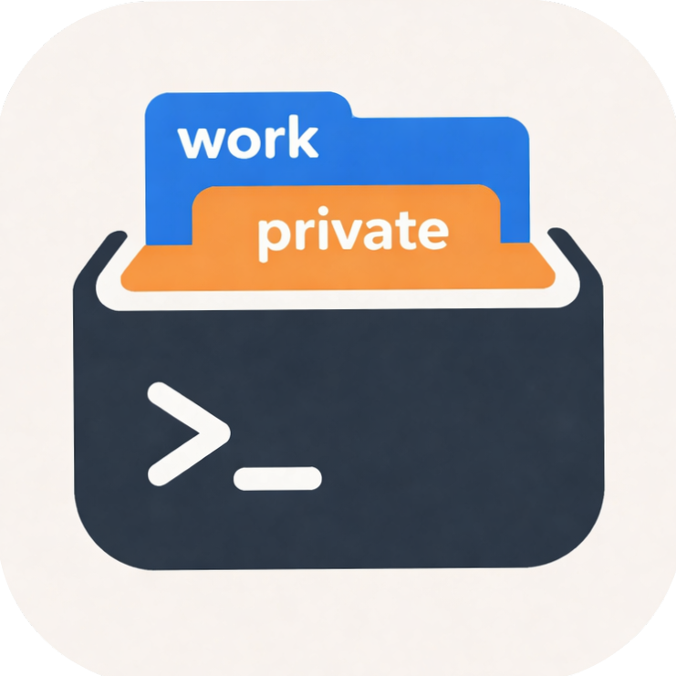

<div align="center">
  
  <h1>ccdocker</h1>

[](https://github.com/yossyl3oy/ccdocker/releases)
[](https://github.com/yossyl3oy/ccdocker/actions)
[](LICENSE)
[-blue)](https://github.com/yossyl3oy/ccdocker)


</div>

Run [Claude Code](https://claude.ai) inside Docker with profile-based account management.

> **Note:** This project is experimental. Some Claude Code features (e.g. voice mode, computer use) are not yet supported but may be added in the future.

## Features

- Native Zig binary for fast startup
- Launch Claude Code in a Docker container with your project directory mounted
- Profile management for switching between accounts (`-p work`, `-p private`)
- Per-directory default profile (`ccdocker set work`)
- Auto-detects and offers to install Docker Desktop or OrbStack
- Auto-rebuilds the image when Dockerfile changes
- Detects Claude Code updates and rebuilds the image automatically
- Image paste support via clipboard bridge and host temp-file mounts
- Shares Git config, GitHub CLI auth, and SSH keys with the container
- Lightweight Debian-based image with essential dev tools pre-installed

## Install

```bash
brew tap yossyl3oy/ccdocker
brew install ccdocker
```

### Build from source

Requires [Zig](https://ziglang.org/) 0.15+.

```bash
git clone https://github.com/yossyl3oy/ccdocker.git
cd ccdocker
zig build -Doptimize=ReleaseSafe
./zig-out/bin/ccdocker -v
```

## Usage

```bash
# Start Claude Code in current directory
ccdocker

# Start with a specific directory
ccdocker ../my-project

# Use a profile
ccdocker -p work
ccdocker -pwork

# Combine path and profile
ccdocker ../my-project -p work

# Login to Claude subscription
ccdocker login
ccdocker login -p work
ccdocker login work

# Set default profile for current directory
ccdocker set work

# Run a command in the container
ccdocker exec bash
ccdocker exec -p work bash

# List profiles
ccdocker profile list

# Version / Help
ccdocker -v
ccdocker version
ccdocker -h
ccdocker help
```

## Profiles

Profiles allow you to manage multiple Claude accounts. Each profile stores its own credentials independently.

```bash
# Login with different profiles
ccdocker login -p work
ccdocker login work
ccdocker login -p private

# Use a profile
ccdocker -p work

# Set default profile for current directory
ccdocker set work

# List all profiles (* = active in current dir)
ccdocker profile list
```

Profiles are stored in `~/.claude-profiles/<name>/`.

Per-directory default profiles are stored in `~/.config/ccdocker/config.json`.

## Volume Mounts

| Host | Container | Mode |
|------|-----------|------|
| Current directory (or specified path) | `/work` | read-write |
| `~/.claude-profiles/<profile>/` | `/root/.claude` | read-write |
| `~/.gitconfig` | `/root/.gitconfig` | read-only |
| `~/.config/gh/` | `/root/.config/gh` | read-only |
| `~/.ssh/` | `/root/.ssh` | read-only |
| `$TMPDIR` (and its realpath alias) | same path on host | read-only |

The bottom four are mounted only if they exist on the host.

## Image Paste

`ccdocker` mirrors the macOS clipboard into the container and also mounts the host temporary directory that terminals often use when pasting screenshots or copied images.

If image paste still does not trigger in Claude Code, use `Ctrl+V` inside the Claude prompt rather than your terminal's generic paste shortcut.

### Extra Mounts

You can add extra host directories to mount into the container (read-only):

```bash
# Add mounts
ccdocker mount add ~/.aws
ccdocker mount add ~/.kube

# List all mounts (default + extra)
ccdocker mount list

# Remove a mount
ccdocker mount remove ~/.aws
```

Paths are automatically mapped (e.g. `~/.aws` → `/root/.aws`). Extra mounts are stored in `~/.config/ccdocker/config.json`.

## Pre-installed Tools

The Docker image (Debian slim) includes tools commonly used by Claude Code:

- `git`, `openssh-client`
- `ripgrep` (rg)
- `fd-find` (fd)
- `curl`, `jq`
- `claude` (installed via [official installer](https://claude.ai/install.sh))

## Container Limits

- Memory: 1 GB (with swap disabled)

## Requirements

- Docker Desktop or [OrbStack](https://orbstack.dev/) (commercial use requires a paid license)
- macOS (Apple Silicon) with Homebrew

## License

[MIT](LICENSE)
